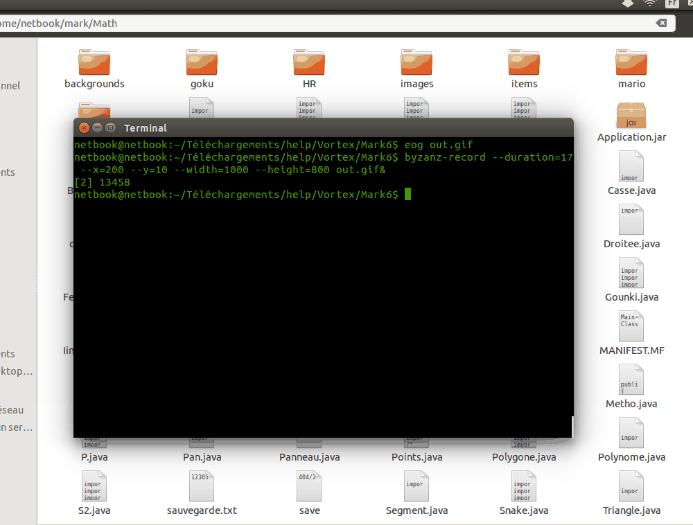
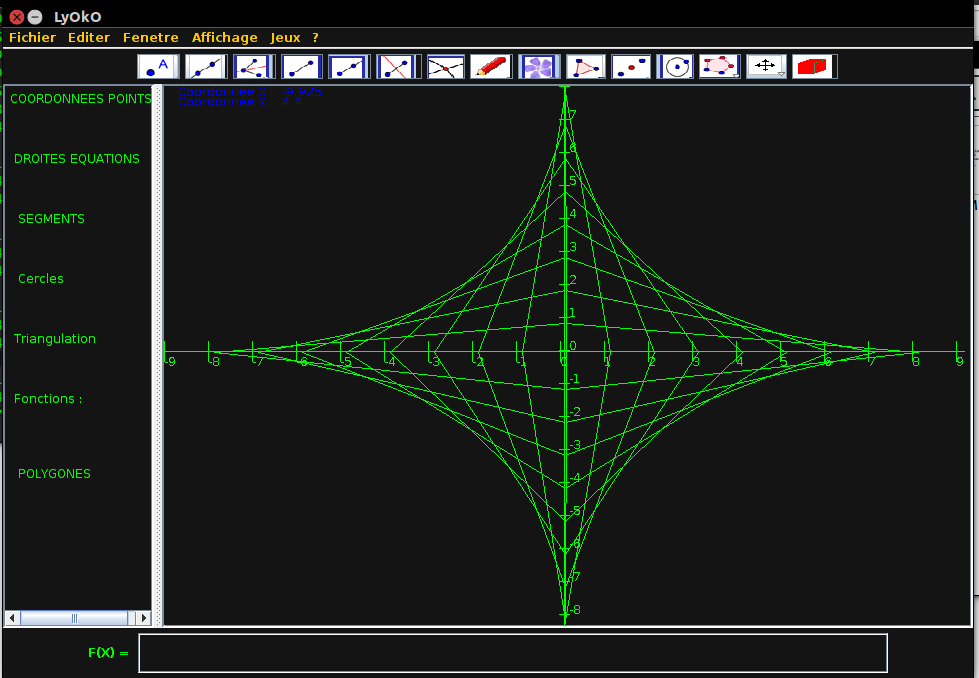
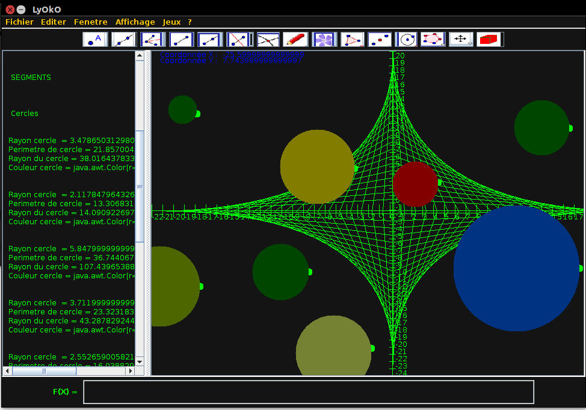

#Projet Dessin Vectoriel : 

Les fichiers sources se trouvent dans le dossier ./Math ,ainsi que leurs fichiers binaires,(.exe et .jar dans le dossier Math/)

<em>Comment executer ?</em>  
Avec un terminal dans Math/ faire java Appli , sinon faire java -jar Application.jar ou cliquer directement dans le .jar sous windows ,il est important de ne pas déplacer ce fichier.

on peut y tracer des fonctions , tracer des droites ,cercles (..)
Pour plus de details se rapporter au .PDF.(pas super complet mais sufficant)

Le programme si presente sous cette forme : 

 

Mais on peut l'appliquer pour par exemple la modélisation ,ou autres : 
 

<em>Modelisation de planetes dans le cosmos!</em>

#fonctions
On peut placer :
-des points (on peut placer le barycentre , il faut pour cela qu'il y ai déjà
des points, il faut cliquer sur le bouton et le graphique pour le faire
apparaitre)
-triangles /polygones régulier
-polygone non régulier(cliquer 2 fois pour confirmer qu'on a fini de
construire le polygone )
-Cercles
-droites (bissectrice /médiatrice /demi-droite)avec leurs paramètres resp
-segments
-dessin au crayon(couleurs changeable)
-Insérer une image (le répertoire Picture a 4 images exemples,il suffit d'y
inscrire le
nom de l'image et le format).
-figure 3dimension (cube ou pavé , ou autre mais dont la base fait 4 cotés)
-Afficher une spirale de points
-Insérer ou enlever le mode 'matrix' c'est a dire changer l'affichage du
graphique.
-outil de sélection (s'applique aux droites)
-trouver l'intersection de 2 droites (uniquement âpres sélection de 2
droites)
-tracer la perpendiculaire , ou la parallèle après sélection d'un droite et
un point.via le menu.
(placer une droite , placer un points ,sélectionner et tracer )
-changer les couleurs d'objets
-afficher une calculatrice
-interpréteur de fonction mathématique (Polynôme et fonction sin,cos ...)
exemple = pol : x^2+5x^1+3 ;(Les touches inertes ne font rien, le mot clé
pol : est important )
ou sin(2x ^ 2) : Trace seulement les traces éventuelles.
-Tracer la dérivé de la fonction polynomiale si on ajoute « derive » apres
la fonction tracé.(éventuellement la tangente en un points sélectionné).
-zoom au centre uniquement(j'ai limité le min volontairement)
-le terminal de droite est aussi un éditeur de texte dont on peut y
enregistrer son fichier a condition d’écrire son extension.
(ex : Jeu.java)
-Des jeux sont disponible en menu(En particulier un jeu de la vie )
-Animation de la courbe du dragon .(+couleur)
-Animation de départ : zoom dé zoom + spiral et arcane lunaire.
-Un mode test avec une voix (JARVIS open source)qui explique toute les
fonctions (trop long..)
-Effacer des données avec l'outil de sélection , (pas tous les objets le
peuvent) OU
Effacer tous le graphique.
-Déplacer un points(Il ne restais que 1 jours lorsque je me suis rendu
compte que le déplacement devais se faire sur tout objets..)
-Sauvegarde de dessins ainsi que les conditions de données.

